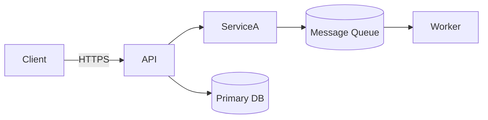

# Architecture

## High-Level Diagram

Replace the diagram above with your system design.

## Components

- **API:** {{ description of API responsibilities }}
- **ServiceA:** {{ description of background service }}
- **Database:** {{ storage technology and purpose }}
- **Worker:** {{ async job processor }}

## Data Flow

1. {{ Step 1 }}
2. {{ Step 2 }}
3. {{ Step 3 }}

## Dependencies

- {{ dependency name }} — {{ reason we depend on it }}

## Operational Concerns

- **Logging:** {{ logging strategy }}
- **Monitoring:** {{ dashboards/alerts }}
- **Scaling:** {{ autoscaling rules or manual process }}
